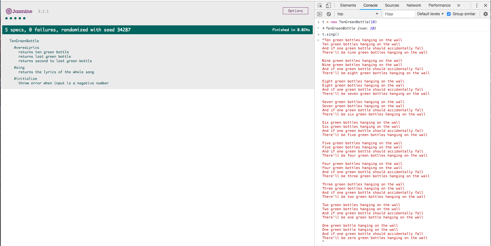

## TenGreenBottle
Write a command line app to print the lyrics of the song 'ten green bottles' to the terminal window (without having to write out each of the verses)
Numbers to words: write an app that can covert a decimal number between 1 and 1000 into the word that represents the number e.g. 1 becomes "one", 89 becomes "eighty-nine".

Use library
[numberToWords package](https://ourcodeworld.com/articles/read/353/how-to-convert-numbers-to-words-number-spelling-in-javascript) to convert number to words

## Launch and Test
```
$ git clone https://github.com/jeff1108/Ten_Green_Bottles.js.git
$ open SpecRunner.html
```
Open the console and type:
```
t = new TenGreenBottle(10)
t.sing()
```

## Example

